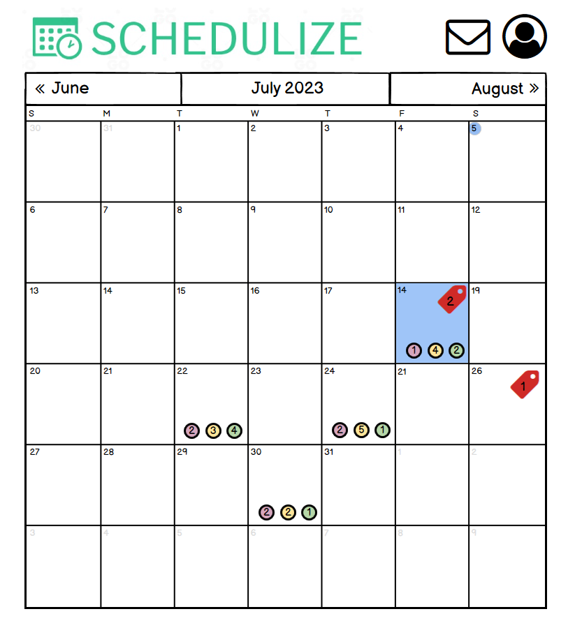
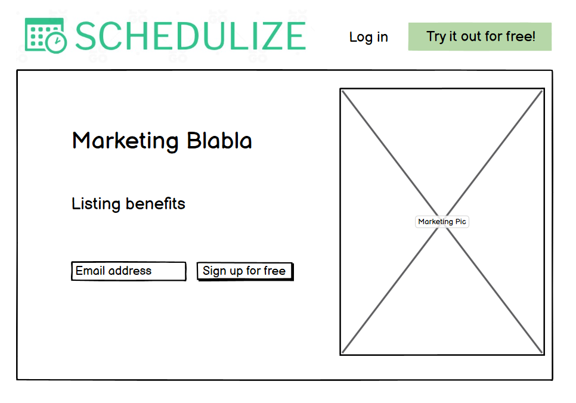

# **Portfolio Project 5 - Schedulize**
<a href="https://chrotesque-cip5-04d27b18c413.herokuapp.com/" target="_blank">View deployed site here.</a>

 

# Table of Contents

0. [WIP](#wip-)
1. [Overview](#overview-)
1. [UX](#ux-)
1. [Model/Agile](#modelagile-)
1. [Features](#features-)
1. [Technologies Used](#technologies-used-)
1. [Validation and Testing](#validation-and-testing-)
1. [Deployment](#deployment-)
1. [Credits](#credits-)

 

# **WIP** ([^](#table-of-contents))
### As this project is still a work in progress, it's feature incomplete:
- task display is only possible through url manipulation and knowing id's of existing tasks
- task creation is possible
- comments, profile displays as well as categories are not implemented
- tasks are visible to all users, which will go back to required changes to the API
- styling in general, the Code Institute module "moments" has been used as basis for development and is still present in lots of places
- syntax / style checking quite possibly incomplete, focus was on this during development but certain style errors might have slipped my attention
- whatever else unforeseen issue exists
- this readme is incomplete as a result of the aforementioned

 

*   ### <a name="wireframes">Wireframes</a>
    -   Main UI Wireframe - Logged In
        
        
         

    -   Home Page Wireframe - Logged in
        