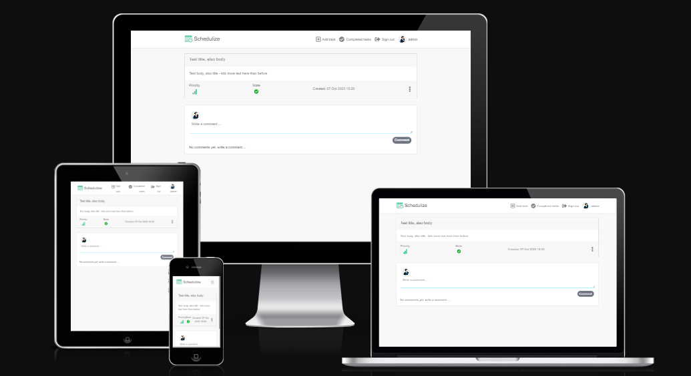
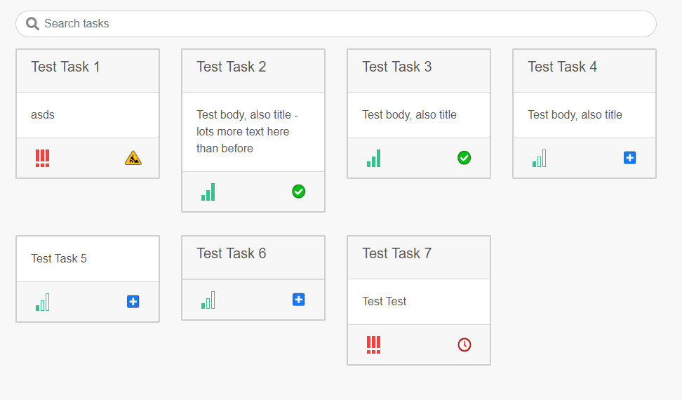
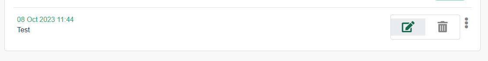
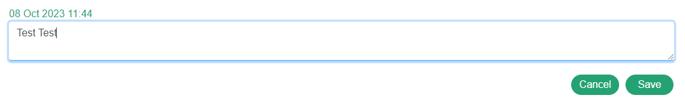

# **Portfolio Project 5 - Schedulize**
<a href="https://chrotesque-cip5-04d27b18c413.herokuapp.com/" target="_blank">View deployed site here.</a> The deployed API can be found <a href="https://chrotesque-cip5-api-7fc69c3bebb4.herokuapp.com/">here</a>.

 

# Table of Contents

1. [Overview](#overview-)
1. [UX](#ux-)
1. [Model](#model-)
1. [Features](#features-)
1. [Technologies Used](#technologies-used-)
1. [Validation and Testing](#validation-and-testing-)
1. [Deployment](#deployment-)
1. [Credits](#credits-)

 

# **Overview** ([^](#table-of-contents))

Schedulize was envisioned to be a task management application for personal use with very limited and optional user interaction, mostly for cooperation purposes. Think Google Keep meets Trello.
Due to time constraints a fair number of features are missing for which there are some basics already in place, such as co-ownership of tasks among others.

 

# **UX** ([^](#table-of-contents))

## Five Planes of UX

### Strategy
- There's plenty of task management services out there, a vast number of them rather complex with loads and loads of features. For me a simple approach as Google Keep is not quite enough, yet a slightly more complex approach like Trello is too much already for what I'm looking for. The Vision for Schedulize was something in between tailored for a single person, possibly 2-3 people working together on tasks of various kinds.
- Having Backend and Frontend separate using an API, implementation of features on the Backend will therefore not affect the Frontend, making a potentially easier development and more important in teams it allows for specialized teams working on their portion of the project separately without getting into each others way
- Just like Django, react is also highly modular and can be expanded for additional features at any given time should the needs call for it

### Scope
- Authentication and CRUD functionality for users for tasks and comments on tasks
- Login status visible to user using a profile picture and the user name, logged out the Navbar changes accordingly
- The main page shows all of the users tasks allowing for quick navigation and then further actions such as editing / deleting them

### Structure
- The structure is simple and to the point, the main page lists all user created tasks and if none exist calls for the creation of tasks, the main navigation contains all necessary functionality apart from commenting on tasks
- Commenting on tasks is at the bottom of a task for tracking additional information that you might want to not keep in the task body itself
- User authentication status is easily visible at the top right in the navigation through profile picture and login/registration buttons outside of being logged in

### Skeleton
- The wireframes can be found further down
- The navigation is presented as top centric bar above all content
- Tasks are listed as cards without pagination
- Forms are being used for all CRUD operations including login and registration
- On mobile the cards will out the entire screen to make the user experience easier

### Surface / Design
- Font Awesome icons were used directly from Font Awesome as well as in Photoshop modified versions for Status / Priority displays
- I decided to go for a light theme with very few colors where they count, for instance buttons as well as various icons
- WIP: Color details after color pass

### Typography
- DM Sans was used for the entire website, sans-serif is being listed as backup just in case

### Imagery
- The logo (and color choice) were both made by an AI service. I fed the service a few key words and among many other suggestions I found the one in use here. Sadly I can't for certain credit the service any longer as I have lost the necessary information, it may have been <a href="https://app.logo.com/ideas">this one</a> though.
- Priority status icons (for Low, Medium, High, Critical) were made by me in Photoshop:

 

- The state icons (for New, Work in Progress, Delayed, Completed) were taken from Font Awesome and modified in Photoshop, each icon was purposfully done in another color for quick identification:

 
 
 
 

### User Stories
- EPIC: Tasks (must-have, completed)
    - Create a task
        - As a user I can create new tasks so that I can keep track of or sort ideas, events and other information.
    - Edit/Delete a task
        - As a user I can edit and/or remove tasks so that I can correct small mistakes or entirely remove them.
    - Search for tasks
        - As a user I can search my entire catalogue of tasks so that I can find a task quicker than looking through all of them manually.
    - View a list of all tasks
        - As a user I can see my tasks in a preview list so that I can see relevant information on a glance before opening up any particular task.
    - View all details of a single particular task
        - As a user I can open up a detailed view of a task so that I can view all information relevant to the task at hand.

- EPIC: Comments (optional, completed)
    - Create a comment
        - As a user I can leave a comment on a task so that I can either communicate with a co-owner or leave myself possibly relevant notes on the task, without touching the tasks body or title.
    - Edit/delete a comment
        - As a user I can edit and delete my existing comments so that I can change the contents of a comment or remove it entirely.

- EPIC: Authentication (must-have, completed)
    - Register a new account
        - As a not-yet-registered-user I can register a new account so that I can start using the website.
    - Visible authentication status
        - As a user or not-yet-registered-user I can see my login status so there is no confusion about my available options.
    - Login existing account
        - As a user I can login to my existing account so that I can start making tasks or continue managing my tasks.
    - Profile management
        - As a user I can access my profile page so that I can modify my avatar image.

- EPIC: Navigation (must-have, completed)
    - Easy navigation
        - As a user, I can view all relevant navigation options from a navigation bar at all times so that I can reliably navigate between pages.
    - Conditional Status Rendering
        - As a user I can login, register or see my profile name in the navigation so that I am informed about my login status if availble and have all required options to interact with the website if not signed up yet.
    - Routing
        - As a user I can browse through all available content without a page refresh so that navigation is as fast as possible and not distracting through unnecessary refreshes.

- EPIC: Categories (optional, not implemented)
    - Create a category
        - As a user I can create new categories so that I can better order / sort my tasks.
    - Edit/delete a category
        - As a user I can edit and remove categories so that I can keep my tasks nicely organized with as much granularity as I desire.
    - Edit/Remove the parent of a category
        - As a user I can edit or remove the parent of a category so that I can further refine the granularity of my categories.

- EPIC: Co-Ownership (optional, not implemented)
    - Add co-owner to a task
        - As a user I can add a co-owner to my task so that I can cooperate on a task.
    - View own tasks with co-owner
        - As a user I can a list of my own tasks that have a co-owner attached so that I can have a better overview of tasks that might need the addition or removal of a co-owner.
    - View tasks created by co-owner
        - As a user I can view all tasks created by a co-owner I am linked with so that I can see their task list.
    - Co-owner linking
        - As a user I can link up with other users to make them co-owners so that I can cooperate on tasks.

### Agile Methodology
- The project was managed using Github Projects
    - <a href="https://github.com/Chrotesque/ci-portfolio-project-5/issues?q=is%3Aissue+label%3AEPIC" target="_blank">Epics</a>, <a href="https://github.com/Chrotesque/ci-portfolio-project-5/issues?q=is%3Aissue+label%3A%22User+Story%22" target="_blank">User Stories</a> and <a href="https://github.com/Chrotesque/ci-portfolio-project-5/issues?q=is%3Aissue+label%3Abug" target="_blank">Bugs</a> that occurred during development for which I had no immediate solution
    - All user stories have acceptance criteria mentioned in the description

 

### Wireframes

-   Main UI Wireframe - Logged In

        
 

-   Home Page Wireframe - Not Logged in / CTA

 

# **Model** ([^](#table-of-contents))

Specifics to the database model can be found on the Github page for the API <a href="https://github.com/Chrotesque/ci-portfolio-project-5-api#model-" target="_blank">right here</a>

 

# **Features** ([^](#table-of-contents))

- The use of react and it's inherit modular design allows for the reuse the elements as visible in the task views, the Task.js is being used for listing the tasks, for editing the tasks as well as the deletion page for tasks, similarly the asset component is also being used in various places for slightly different purposes

- Authentication is being handled through the <a href="https://github.com/Chrotesque/ci-portfolio-project-5-api" target="_blank">API</a> via dj-rest-auth. Practically any feature/page requires a login. Access to task creation, editing and deletion is not available without being logged in with the creators user account. Direct URL access to those features is also being redirected away.

- The navigation when logged in:

    

- The navigation when logged out:

    

 

## The following can only be seen by registered and logged in users:

### Tasks

- Creation of new tasks with either title and/or body (one of them is required but not both), state and priority

    

- The Task Overview shows all relevant task information and offers options for editing & deletion through a dropdown menu:

    

- Editing a task

    

- Deleting a task requiring a confirmation

    

- Listing all of your created tasks:

    

- And only listing those that are completed:

    

- Tasks can be searched for:

    

 

### Comments

- Each tasks can contain comments that are listed underneath:

    

- Comments have a dropdown options menu for editing/deletion:

    

- Comments have an edit screen, unlike deletion which occurs immediately upon click:

    

## Special Mentions
- Conditional rendering was used on a fair number of pages like so, despite history.push("/") if access was requested by a non-user or not the owner of the task:
    > <Container>{currentUser ? form : login}</Container>
    - Technically unnecessary, however without the conditional rendering the page shortly shows the content (possibly due to the dev environment being a bit slower than the deployed version), while the conditional rendering makes the experience simply a bit smoother

- The state system either shows my lack of knowledge in how to filter out tasks with the state 'DON' and show all others OR the database design is simply lacking, thus the standard listing of tasks shows all tasks including the ones that are listed as 'DON' already

## Missing Features

- Various features are missing despite being halfway implemented or having database support already, these were mostly not implemented due to Time constraints
    - Categories
        - tasks can be assigned a category and those can be endlessly nested as required
        - the current implementation requires further modifcation as it would currently create site-wide categories for all users, which might get really convulated with more users using the service, so they would either likely be user specific OR more efficiently be shared if more than one user uses the same categories, which would then duplicate those IF modifications were made to them
    - Due Date
        - the due date was close to implementation but a few changes were necessary to make the editing of dates work with the date format provided by the API
    - Co-Ownership
        - Other users were meant to be invited to be assigned your own tasks, sharing editing capabilities
        - Additional features could include a listing of co-owned tasks or the tasks from the invited co-owners
        - Inviting would ideally not feature a search but rather sending out the invite to a user name / email to maintain privacy, also a service with thousands or more users would make a search bothersome and sluggish/slow
    - Profiles
        - Profile display including changing ones avatar not implemented, as such I removed all displays of the avatar but left the component

 

# **Technologies Used** ([^](#table-of-contents))

### Languages Used

-   [HTML 5](https://en.wikipedia.org/wiki/HTML/)
-   [CSS 3](https://en.wikipedia.org/wiki/CSS)
-   [JavaScript](https://de.wikipedia.org/wiki/JavaScript)
-   [ReactJS](https://en.wikipedia.org/wiki/React_(JavaScript_library))

### Frameworks, Libraries & Programs Used

1. [My API](https://github.com/Chrotesque/ci-portfolio-project-5-api)
    - For handling all data as well as authentication
1. [Git](https://git-scm.com/)
    - Git was used for version control by utilizing the Gitpod terminal to commit to Git and Push to GitHub.
1. [GitHub:](https://github.com/)
    - GitHub is used to store the project's code after being pushed from Git.
1. [Font Awesome:](https://fontawesome.com/)
    - Font Awesome was used to add icons for aesthetic and UX purposes.
1. [Bootstrap](https://getbootstrap.com/)
    - Used to make the Website responsive and style it.
1. [Axios](https://axios-http.com/docs/intro)
    - For making API requests.
1. [JWT Decode](https://jwt.io/)
    - For Decoding JSON Web Tokens.
1. [React Router](https://reactrouter.com/en/main)
    - For routing of the Website.
1. [Mock Service Worker](https://mswjs.io/)
    - For automatical testing of React Components.
1. [Heroku](https://www.heroku.com/)
    - For deployment of the Project
1. [W3C - HTML](https://validator.w3.org/)
    - For validating the HTML code
1. [W3C - CSS](https://jigsaw.w3.org/css-validator/)
    - For validating the CSS Code
1. [a11y](https://color.a11y.com/Contrast/)
    - For validating the contrast of colors used on the Website
1. [Balsamiq](https://balsamiq.com/)
    - Balsamiq was used to create [Wireframes](#wireframes) for the project.
1. [Photoshop:](https://www.adobe.com/products/photoshop/)
    - Photoshop was used to modify some Font Awesome icons and to create some from scratch.

 

# **Testing** ([^](#table-of-contents))

## ESLint
- No errors were found for the entirety of the src folder

## W3C Markup Validation Service
- URL testing impossible due to content being behind a login, manual testing done through source code pasting of all pages
- "No errors or warnings to show."

## W3c CSS Validation Service
- Manually tested CSS code of all style files found in src/styles & App.module.css
- "Congratulations! No Error Found."

## a11y Contrast Testing
- Auomated testing can't check much without login
- Manual testing revealed a few issues which were fixed

## Google Lighthouse

- Index page on desktop:

 

- Index page on mobile:

 

- Task view page on desktop:

- Task view page on mobile:

### Best Practice hits are
- Low Resolution images, for the use case this shouldn't be a concern but can easily be remedied for, currently, no benefit

- Cross Site Cookies, as of right now still allowed but will be an issue in the future

## Automated Tests

All automated tests worked flawlessly with the Mock Service Worker. The tests were also covered in the Moments Walkthrough project and are just to showcase my understanding for the following tests:
- renders NavBar element
- renders link to the user name for a logged in user
- renders login / signup buttons on logout

More were not implemented due to time constraints.

 

 

# **Deployment** ([^](#table-of-contents))

## Creating a React app

1. Using the template specified in the Credits section create a new Repository
1. Click the "Gitpod" Button to create an empty workspace.
1. Install Node Package Manager by typing "npm install"
1. You can start your Server with "npm start" and check if everything runs fine.
1. You should now see the basic deployment welcome page of React.

## Deployment on Heroku

1. Log in to [Heroku](https://www.heroku.com)
1. When you see your Dashboard, click on "New" and select "Create New App"
1. Enter the App name and select your region then click on "Create App"
1. On the Top Nav now select "Deploy". Select GitHub as the deployment option and connect to your GitHub repository. Search for your repository name and click on the "connect" button.
1. At the bottom of the page, you will be able to choose between automatic and manual deployment. Choose your preferred method.

## Finalizing Deployment 

1. You have to first install the [API](https://github.com/Chrotesque/ci-portfolio-project-5-api) and deploy it. Please copy the link of the deployed API.
1. In src/api/axiosDefaults.js, copy the link next to "axios.defaults.baseURL =" with singlequotes next to it, e.g. "axios.defaults.baseURL = 'https://mydeployedapi-randomsymbols.herokuapp.com/';". Do not forget the ";" at the end of it.
1. This is to connect to the API and is mandatory for the Project to work.
1. Create a Procfile with one line of content: "web: serve -s build".
1. Deploy the final Code on Heroku

### Forking the GitHub Repository

- By forking the GitHub Repository we make a copy of the original repository on our GitHub account to view and/or make changes without affecting the original repository by using the following steps:

1. Log in to GitHub and locate the [GitHub Repository](https://github.com/Chrotesque/ci-portfolio-project-5)
1. At the top of the Repository (not the top of the page) just above the "Settings" button on the menu, locate the "Fork" button.
1. You should now have a copy of the original repository in your GitHub account.

### Making a Local Clone

1. Log in to GitHub and locate the [GitHub Repository](https://github.com/Chrotesque/ci-portfolio-project-5)
1. Under the repository name, click "Clone or download".
1. To clone the repository using HTTPS, under "Clone with HTTPS", copy the link.
1. Open Git Bash
1. Change the current working directory to the location where you want the cloned directory to be made.
1. Type "git clone", and then paste the URL you copied in Step 3.
1. Press Enter. Your local clone will be created.

Click [Here](https://help.github.com/en/github/creating-cloning-and-archiving-repositories/cloning-a-repository#cloning-a-repository-to-github-desktop) to retrieve pictures of some of the buttons and more detailed explanations of the above process.

 

# **Credits** ([^](#table-of-contents))

- <a href="https://github.com/Code-Institute-Org/react-ci-template/generate">React Template</a> by <a href="https://codeinstitute.net/global/" target="_blank">Code Institute</a> to get started with the project

### Code & Media

- A significant portion of the code used was based off of the Code Institute Module "Moments". Modifications were made were it was deemed necessary to fit a certain functionality or desired aesthetic.
Some assets were also reused here as they fit perfectly.
- Some Font Awesome icons were modified in Photoshop and subsequently used, as listed above in the UX section

### Thanks
- My <a href="https://github.com/Chrotesque/ci-portfolio-project-1" target="_blank">Girlfriend</a> without whom I wouldn't have attempted to finish any of this 
- Code Institutes Student Care continued to help me after a difficult time and gave me lots of extra leeway. 